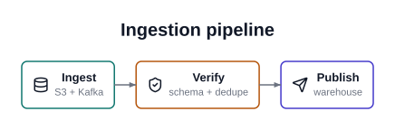
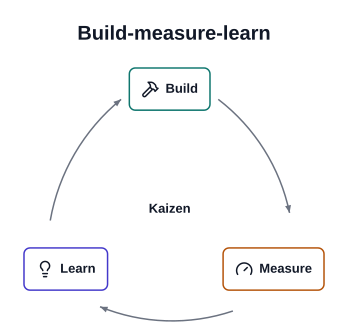
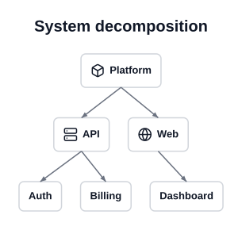
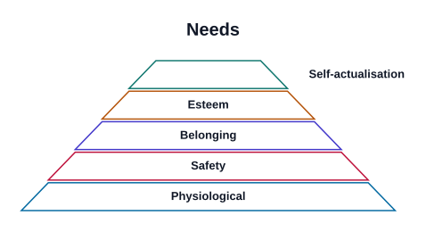
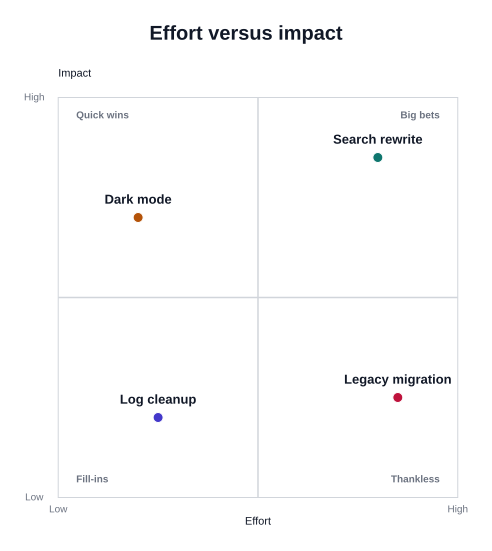
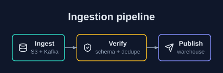
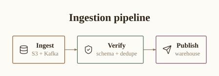

# prism

**Declarative YAML → SVG diagrams.** You describe what a picture *means*; prism
decides the geometry, spacing, typography and colour.

[](https://opensource.org/licenses/MIT)
[](https://www.python.org)
[](https://apiad.github.io/prism)

📖 **[Documentation](https://apiad.github.io/prism)** — [tutorial](https://apiad.github.io/prism/tutorial.html)
· [catalog](https://apiad.github.io/prism/catalog.html)
· [themes](https://apiad.github.io/prism/themes.html)
· [for agents](https://apiad.github.io/prism/agents.html)

```yaml
type: flow
title: Ingestion pipeline
steps:
  - {label: Ingest,  sublabel: S3 + Kafka,      icon: database,     accent: 0}
  - {label: Verify,  sublabel: schema + dedupe, icon: shield-check, accent: 1}
  - {label: Publish, sublabel: warehouse,       icon: send,         accent: 2}
```

```bash
prism render pipeline.yaml -o pipeline.svg
```



## Why

Diagram-as-code tools — Mermaid, PlantUML, D2, Graphviz — model **graph
topology**, and they are excellent at it. But a great many explanatory pictures
are not graphs: pyramids, funnels, quadrants, timelines, comparisons, radial
hubs. Those tools have no vocabulary for them, and theming is an afterthought,
so the output reads as an engineering diagram rather than an explainer.

Tools that *do* have that vocabulary — Napkin AI and friends — are closed SaaS
with no library surface and no way for an agent to drive them.

prism is the missing middle: open, template-rich, themeable, and designed to be
driven by a language model or a Makefile.

## Install

```bash
pip install prism-svg     # the import name is `prism`
```

Runtime dependencies: [tesserax](https://github.com/apiad/tesserax) (pure-Python
SVG and layout), PyYAML, pydantic. Nothing else — no browser, no headless
Chrome, no system libraries.

## The catalog

Ten archetypes, chosen by the *shape of the meaning* rather than the subject:

| | | |
|---|---|---|
| **`flow`** — ordered steps | **`hierarchy`** — trees | **`cycle`** — closed loops |
| **`timeline`** — chronology | **`comparison`** — options weighed | **`quadrant`** — two dimensions |
| **`pyramid`** — layered magnitude (or a funnel) | **`stack`** — system tiers | **`hub`** — a centre and its spokes |
| **`matrix`** — values at intersections | | |

<p align="center">
  
  
</p>
<p align="center">
  
  
</p>

Every archetype, with the spec that produced it, is in the
[catalog](https://apiad.github.io/prism/catalog.html).

## Themes

A theme is **data, not code** — a token set in YAML covering palette,
typography and geometry. Archetypes read tokens only; a literal colour inside
an archetype is a bug. Because tokens are semantic (`ink`, `surface`, `muted`)
rather than literal, dark mode falls out for free.

Four ship: `default`, `dark`, `paper`, `mono`.

<p align="center">
  
  
</p>

Override individual tokens per spec, or point `theme:` at your own file:

```yaml
type: flow
theme: dark
tokens:
  palette.ink: "#f8fafc"
  geometry.radius: 2
```

## Using it

```python
import prism

prism.render("spec.yaml", "out.svg")  # write a file
svg = prism.render_str(spec_text)  # get the string
prism.diagram("spec.yaml")  # self-displaying, for Jupyter/Quarto
```

```bash
prism render spec.yaml -o out.svg
prism archetypes     # list the catalog
prism themes         # list bundled themes
prism new-theme house --from paper   # scaffold an editable theme file
prism icons          # list the 1756 vendored Lucide icons
prism schema flow    # JSON Schema, for tool calling
```

## For agents

prism never calls a language model. The agent does the part models are good at
— reading prose and deciding what shape an idea has — and prism does the part
models are bad at: geometry, spacing, alignment and colour. Rendering is
deterministic; the same spec always produces byte-identical SVG.

The vocabulary is closed and flat, which is what makes it reliable for small
models: one `type`, one shared node shape, no nesting. `prism schema <name>`
emits JSON Schema for structured output, and errors are written to be recovered
from rather than merely reported:

```
unknown icon 'databse' — did you mean: database, data-flow?
unknown archetype 'flowchart' — did you mean: flow?
cell references unknown row 'emae'; known rows: ['emea', 'amer', 'apac']
```

See the [agent guide](https://apiad.github.io/prism/agents.html), or hand a model
[`SKILL.md`](SKILL.md) directly.

## For books and Quarto

Results render themselves in any IPython-compatible environment:

````markdown
```{python}
#| echo: false
import prism
prism.diagram("figures/pipeline.yaml")
```
````

SVG stays sharp at any size, keeps text selectable and searchable, and diffs
sensibly in git. See [using prism in Quarto](https://apiad.github.io/prism/quarto.html).

## One detail worth knowing

Every label is measured against **vendored font metrics** before its box is
drawn. That sounds like a footnote; it is the difference between a diagram and
a mess. The usual shortcut — estimating text width as `characters × size × 0.6`
— is wrong by **+116%** on `lllll` and **−28%** on `MMMMM`, so boxes come out
either absurdly padded or overflowing their borders.

prism vendors advance-width tables for the three font stacks that have
metric-compatible clones on every platform (Arial, Times New Roman, Courier
New), wraps text itself, and hands true bounds to the layout engine. That is
also why `typography.family` and `typography.weight` are restricted to what
prism can actually measure: offering a font it has not measured would quietly
reintroduce the overflow.

## Development

```bash
uv sync
uv run python -m pytest          # the suite
uv run ruff check . && uv run ruff format --check .
uv run python scripts/build_gallery.py    # regenerate docs/gallery + doc pages
uv run quarto render docs                 # build the docs site
```

### Releasing

Publishing uses [PyPI trusted publishing](https://docs.pypi.org/trusted-publishers/)
— OIDC, no API token stored anywhere. To ship a version:

1. Bump `version` in `pyproject.toml` and `__version__` in `prism/__init__.py`.
2. Move the `CHANGELOG.md` entries under a new heading.
3. Publish a GitHub release tagged `vX.Y.Z`.

`.github/workflows/release.yaml` then runs the gates, verifies the tag matches
the packaged version, builds an sdist and a wheel, and publishes through the
`pypi` environment.

Two vendoring scripts regenerate bundled data and are not run at install time:
`scripts/build_metrics.py` (font advance widths, from the Liberation faces) and
`scripts/build_icons.py` (Lucide icons, normalised to path data).

### Working on prism

[`AGENTS.md`](AGENTS.md) is the door — the pipeline, the conventions and the
sharp edges — with procedure docs in [`know-how/`](know-how/):
[adding an archetype](know-how/adding-an-archetype.md),
[authoring a theme](know-how/authoring-a-theme.md),
[typography and icons](know-how/typography-and-icons.md),
[releasing](know-how/releasing.md).

The full design is at
[`docs/specs/2026-07-29-declarative-diagrams-design.md`](docs/specs/2026-07-29-declarative-diagrams-design.md).

## Credits

Built on [tesserax](https://github.com/apiad/tesserax). Icons from
[Lucide](https://lucide.dev) (ISC). MIT licensed.
