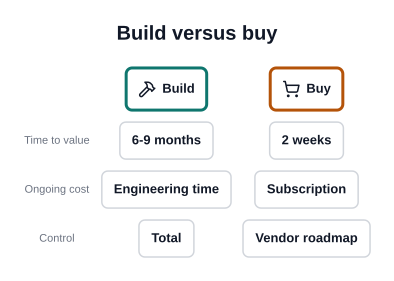
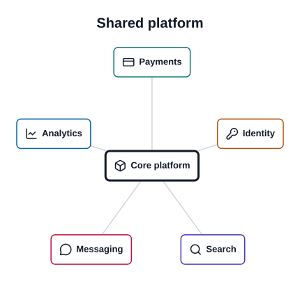
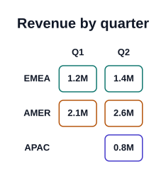
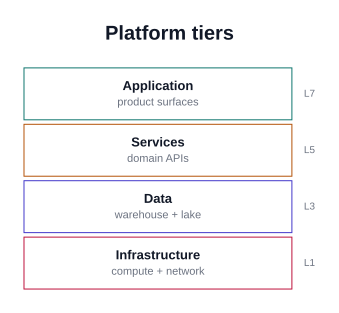
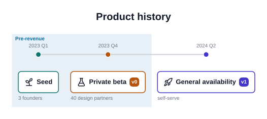

prism ships 10 archetypes. Each one is opinionated: you describe the
*meaning* of the picture and prism decides the geometry, spacing and colour.

Every diagram below is generated from the YAML shown beside it, by the same
code path the library exposes. If an example stopped rendering, this page
could not be built.


## `comparison`

Side-by-side columns. Add `criteria` to align the rows.



```yaml
type: comparison
title: Build versus buy
criteria: [Time to value, Ongoing cost, Control]
columns:
  - header: {label: Build, icon: hammer}
    items:
      - {label: 6-9 months}
      - {label: Engineering time}
      - {label: Total}
  - header: {label: Buy, icon: shopping-cart}
    items:
      - {label: 2 weeks}
      - {label: Subscription}
      - {label: Vendor roadmap}
```

See the full field list with `prism schema comparison`.

## `cycle`

A closed loop. Iterative processes that return to their start.


```yaml
type: cycle
title: Build-measure-learn
center: {label: Kaizen}
steps:
  - {label: Build, icon: hammer, accent: 0}
  - {label: Measure, icon: gauge, accent: 1}
  - {label: Learn, icon: lightbulb, accent: 2}
```

See the full field list with `prism schema cycle`.

## `flow`

Steps, in order. The workhorse: pipelines, processes, decisions.


```yaml
type: flow
title: Ingestion pipeline
steps:
  - {id: ingest, label: Ingest, sublabel: S3 + Kafka, icon: database, accent: 0, badge: "1", note: continuous}
  - {id: verify, label: Verify, sublabel: schema + dedupe, icon: shield-check, accent: 1, badge: "2", note: drops on conflict}
  - {id: publish, label: Publish, sublabel: warehouse, icon: send, accent: 2, badge: "3", note: nightly}
```

See the full field list with `prism schema flow`.

## `hierarchy`

A tree — org charts, decomposition, taxonomies. The one archetype whose data is recursive.


```yaml
type: hierarchy
title: System decomposition
root:
  label: Platform
  icon: box
  children:
    - label: API
      icon: server
      children:
        - {label: Auth}
        - {label: Billing}
    - label: Web
      icon: globe
      children:
        - {label: Dashboard}
```

See the full field list with `prism schema hierarchy`.

## `hub`

A centre and its spokes.



```yaml
type: hub
title: Shared platform
center: {label: Core platform, icon: box}
spokes:
  - {label: Payments, icon: credit-card, accent: 0}
  - {label: Identity, icon: key-round, accent: 1}
  - {label: Search, icon: search, accent: 2}
  - {label: Messaging, icon: message-circle, accent: 3}
  - {label: Analytics, icon: chart-line, accent: 4}
```

See the full field list with `prism schema hub`.

## `matrix`

Row and column headers with sparse cells.



```yaml
type: matrix
title: Revenue by quarter
rows:
  - {id: emea, label: EMEA}
  - {id: amer, label: AMER}
  - {id: apac, label: APAC}
columns:
  - {id: q1, label: Q1}
  - {id: q2, label: Q2}
cells:
  - {row: emea, column: q1, label: 1.2M, accent: 0}
  - {row: emea, column: q2, label: 1.4M, accent: 0}
  - {row: amer, column: q1, label: 2.1M, accent: 1}
  - {row: amer, column: q2, label: 2.6M, accent: 1}
  - {row: apac, column: q2, label: 0.8M, accent: 2}
```

See the full field list with `prism schema matrix`.

## `pyramid`

Layered magnitude. Give the levels `value` and it reads as a funnel.


```yaml
type: pyramid
title: Needs
levels:
  - {label: Self-actualisation}
  - {label: Esteem}
  - {label: Belonging}
  - {label: Safety}
  - {label: Physiological}
```

See the full field list with `prism schema pyramid`.

## `quadrant`

A 2x2 field with named axes and items placed by coordinate.


```yaml
type: quadrant
title: Effort versus impact
axes:
  x: {label: Effort, low: Low, high: High}
  y: {label: Impact, low: Low, high: High}
quadrant_labels: [Quick wins, Big bets, Fill-ins, Thankless]
items:
  - {label: Search rewrite, x: 0.8, y: 0.85}
  - {label: Dark mode, x: 0.2, y: 0.7}
  - {label: Log cleanup, x: 0.25, y: 0.2}
  - {label: Legacy migration, x: 0.85, y: 0.25}
```

See the full field list with `prism schema quadrant`.

## `stack`

Tiers, drawn as full-width bars, with optional side annotations.



```yaml
type: stack
title: Platform tiers
layers:
  - {label: Application, sublabel: product surfaces, side: L7}
  - {label: Services, sublabel: domain APIs, side: L5}
  - {label: Data, sublabel: warehouse + lake, side: L3}
  - {label: Infrastructure, sublabel: compute + network, side: L1}
```

See the full field list with `prism schema stack`.

## `timeline`

Chronology, with optional era bands spanning a range of events.



```yaml
type: timeline
title: Product history
events:
  - {id: seed, when: 2023 Q1, label: Seed, icon: sprout, accent: 0, note: 3 founders}
  - {id: beta, when: 2023 Q4, label: Private beta, icon: flask-conical, accent: 1, badge: v0, note: 40 design partners}
  - {id: ga, when: 2024 Q2, label: General availability, icon: rocket, accent: 2, badge: v1, note: self-serve}
eras:
  - {label: Pre-revenue, span: [seed, beta], accent: 4}
```

See the full field list with `prism schema timeline`.
