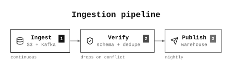
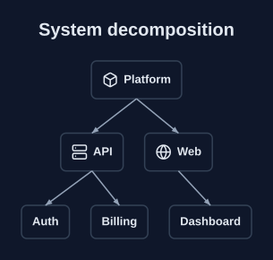
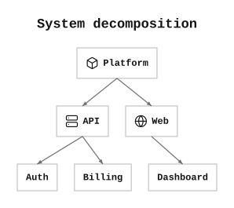
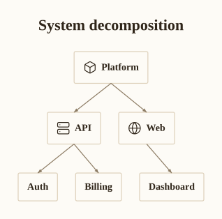
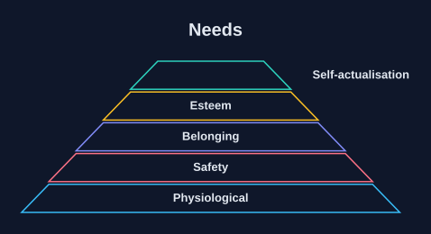
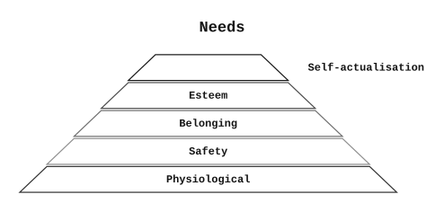
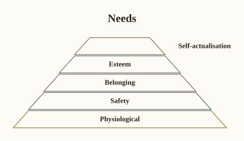
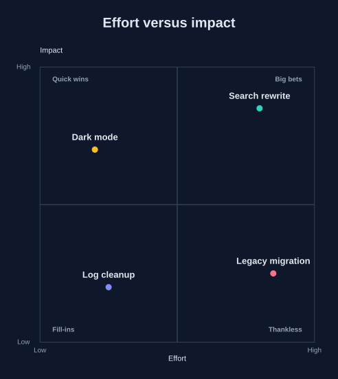
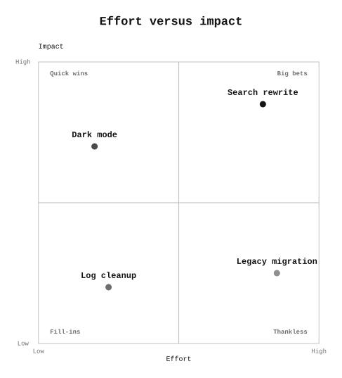
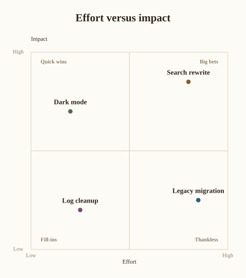

A theme is **data, not code** — a token set in YAML covering palette,
typography and geometry. Archetypes read tokens only; a literal colour
anywhere in an archetype is a bug.

Because the tokens are semantic (`ink`, `surface`, `muted`) rather than
literal (`black`, `white`), dark mode falls out for free.

```bash
prism themes           # list what ships
prism render d.yaml    # honours the spec's `theme:` field
```

Any spec can also override individual tokens inline by dotted path:

```yaml
type: flow
theme: dark
tokens:
  palette.ink: "#f8fafc"
  geometry.radius: 2
steps:
  - {label: Draft}
  - {label: Ship}
```

Or point `theme:` at your own YAML file, which is how you brand a whole
document set.


## The bundled themes

::: {.theme-grid}

<figure>

<figcaption><code>dark</code></figcaption>
</figure>

<figure>

<figcaption><code>default</code></figcaption>
</figure>

<figure>

<figcaption><code>mono</code></figcaption>
</figure>

<figure>

<figcaption><code>paper</code></figcaption>
</figure>

:::


## The same catalog, themed

Every archetype renders in every theme. A few, side by side:


### `hierarchy`


::: {.theme-grid}

<figure>

<figcaption><code>dark</code></figcaption>
</figure>

<figure>

<figcaption><code>default</code></figcaption>
</figure>

<figure>

<figcaption><code>mono</code></figcaption>
</figure>

<figure>

<figcaption><code>paper</code></figcaption>
</figure>

:::


### `pyramid`


::: {.theme-grid}

<figure>

<figcaption><code>dark</code></figcaption>
</figure>

<figure>

<figcaption><code>default</code></figcaption>
</figure>

<figure>

<figcaption><code>mono</code></figcaption>
</figure>

<figure>

<figcaption><code>paper</code></figcaption>
</figure>

:::


### `quadrant`


::: {.theme-grid}

<figure>

<figcaption><code>dark</code></figcaption>
</figure>

<figure>

<figcaption><code>default</code></figcaption>
</figure>

<figure>

<figcaption><code>mono</code></figcaption>
</figure>

<figure>

<figcaption><code>paper</code></figcaption>
</figure>

:::


## Writing your own

Copy a bundled theme and edit the tokens. Two constraints are enforced at load time:

- `typography.family` must be `grotesque`, `serif` or `mono` — the three stacks whose font metrics prism vendors.
- `typography.weight.*` must be `400` or `700`, for the same reason. A weight prism has not measured would be synthesised by the viewer at a width prism never accounted for, and labels would overflow their boxes.
